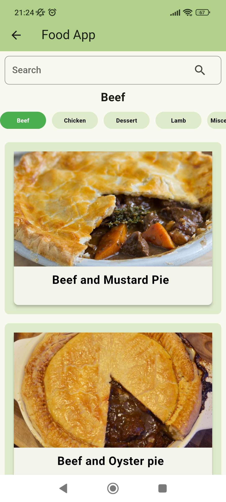
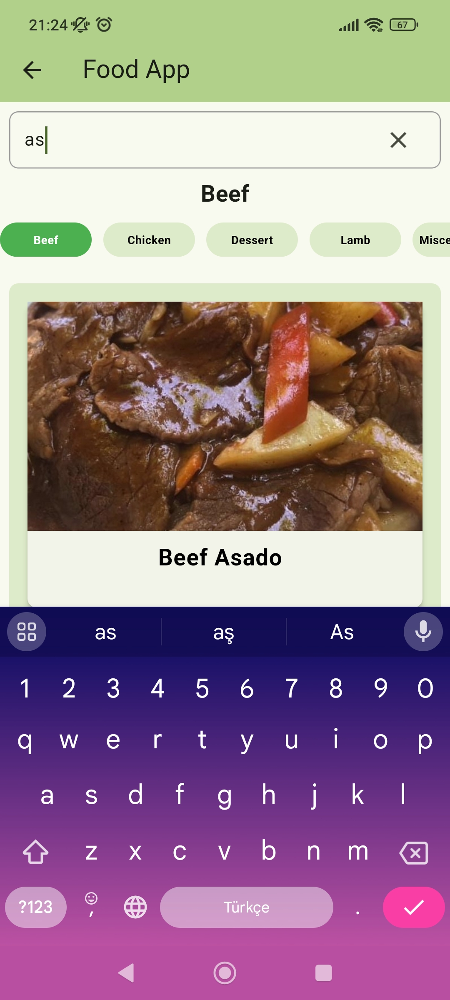

# TR

### Bilgi

- **Üniversite:** Erciyes Üniversitesi
- **Bölüm:** Bilgisayar Mühendisliği
- **Öğretim Üyesi:** Dr. Öğretim Üyesi Fehim Köylü
- **Ders Adı:** Mobil Application Development

---

### Flutter Food App

Bu uygulama, kullanıcıların çeşitli yemekler hakkında bilgi alabilecekleri ve tariflere erişebilecekleri bir mobil uygulamadır. Kullanıcılar, yemek kategorilerini keşfedebilir ve ilgili tariflere göz atabilirler.

### Özellikler

- Farklı yemek kategorileri
- Yemek tariflerine göz atma
- Yemekler hakkında detaylı bilgi alma
- Yemeklerin detayında videolu anlatım
- Arama yapabilme

### Kullanılan Teknolojiler ve Kütüphaneler

- Flutter SDK & dart
- http
- setState
- listbuilder
- Rest JSON
- toastification
- Youtube_player_iframe
- Hero animasyonu
- async işlemler

### Kurulum

1. Bu depoyu klonlayın: `git clone https://github.com/mehmetkekec58/flutter-food-app.git`
2. Gerekli paketleri yükleyin: `flutter pub get`
3. Uygulamayı başlatın: `flutter run`

### Kullanım

Uygulama başlatıldığında ana sayfa, popüler yemek kategorilerini gösterir. Kullanıcılar, kategorilere göz atabilir, kategorilere tıklayarak yemeklere göz atabilir, arama yapabilir ve yemek tariflerini inceleyebilirler.

---

### Ekran Görüntüleri

Aşağıda, uygulamanın ekran görüntüleri bulunmaktadır:

1. **Ana Sayfa**: Popüler yemek kategorilerini gösterir.

2. **Kategori Sayfası**: Seçilen kategoriye ait yemek tariflerini listeler.

3. **Yemek Detay Sayfası**: Seçilen yemeğin detaylı bilgilerini ve tarifini gösterir.

4. **Arama Sayfası**: Kullanıcıların yemek tarifleri arayabileceği search bar.

# EN

### Information

- **University:** Erciyes University
- **Department:** Computer Engineering
- **Instructor:** Dr. Fehim Köylü
- **Course Name:** Mobile Application Development

---

### Flutter Food App

This application is a mobile app where users can get information about various dishes and access recipes. Users can explore food categories and browse related recipes.

### Features

- Different food categories
- Browse recipes
- Get detailed information about dishes
- Video descriptions in the details of dishes
- Search functionality

### Technologies and Libraries Used

- Flutter SDK & dart
- http
- setState
- listbuilder
- Rest JSON
- toastification
- Youtube_player_iframe
- Hero animation
- async operations

### Installation

1. Clone this repository: `git clone https://github.com/mehmetkekec58/flutter-food-app.git`
2. Install the required packages: `flutter pub get`
3. Run the application: `flutter run`

### Usage

When the application starts, the homepage displays popular food categories. Users can browse categories, click on categories to view recipes, search, and examine the recipes.

---

### Screenshots

Below are the screenshots of the application:

1. **Home Page**: Displays popular food categories.

2. **Category Page**: Lists recipes belonging to the selected category.

3. **Recipe Detail Page**: Shows detailed information and recipe of the selected dish.

4. **Search Page**: A search bar where users can search for recipes.

